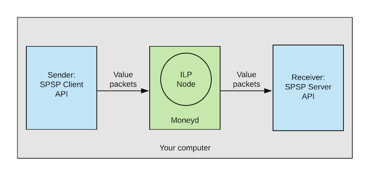

# Getting Started

This tutorial will help you start an Interledger node locally on you computer and create a local ILP test network.

This tutorial describes how to:
1. Install [`moneyd`](../concepts/moneyd.md) on your system
2. Start an [Interledger](https://github.com/interledgerjs/ilp-connector) node on a local test network using moneyd
3. Send and receive value using the [SPSP](../concepts/spsp.md) (Simple Payment Setup Protocol) API



## Before you begin
* Install a stable version of [Node.js](https://nodejs.org/en/) (10.16.0 LTS is recommended)
* Set up Node to install modules globally <br/>

NOTE: For this tutorial you *do not* need to use any cryptocurrency.

## Installing moneyd
To install `moneyd`, open a terminal and run the following command:
```shell
$ npm install -g moneyd
```

## Starting a node
After you’ve installed `moneyd`, run the following command to start your local node:
```shell
$ moneyd local
```
Running the above command creates an Interledger node that listens on port 7768.

## Sending and receiving value
Once you have `moneyd` running, you can send and receive value over ILP using the SPSP API. For this tutorial, 
we’ll use the SPSP command line tool.

### Installing the SPSP client and server
To install an SPSP client and server, open a new command line and run:
```shell
$ npm install -g ilp-spsp ilp-spsp-server
```
### Starting the SPSP server
By default, the SPSP server uses [localtunnel](https://localtunnel.github.io/www/) to create an HTTP endpoint. 
Alternatively, we can set up the server on `localhost` and `port` by disabling localtunnel.

To receive value, start the SPSP server using the following command:
```shell
$ ilp-spsp-server --localtunnel false --port 8080
```
The above command will create `http://localhost:8080` as your HTTP endpoint. 

### Sending value
Now, to send value, open another terminal and run:

```shell
$ ilp-spsp send --amount 10 --receiver 'http://localhost:8080'
```

You should see `sent!` on the sending terminal and `got packet for 10 units` on the receiving terminal confirming 
that you have successfully sent and received value through the Interledger protocol. You are now ready to [use 
SPSP in your applications.](sending-value-programmatically.md)
