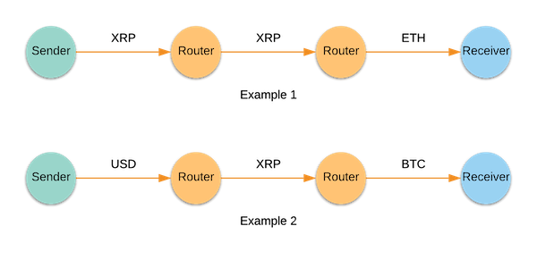

# Interledger Overview
Interledger enables the seamless exchange of value across different payment networks. 
Traditional payment networks operate independently from each other. Sending value is easy only if the sender and 
recipient have accounts on the same network, but it can be slow and expensive if they have accounts on 
different networks.

Interledger is not tied to any one company, blockchain, or currency. You can easily send XRP to someone who wants to 
receive ETH, or you can send USD through a Paypal account to someone who wants to receive USD in a Venmo account. 
Interledger makes it easy to transact in whatever currency or payment network you choose.

## What is Interledger?
Interledger is a network of computers for sending value across independent payment networks. Similar to the Internet, 
Interledger routes packets of value from source to destination. Computers on the Interledger network are 
called *nodes*. Nodes can take one or more of the following roles: 
* Sender Node – Initiates a value transfer
* Router Node – Applies currency exchange and forwards packets of value. This is the intermediary node between 
the sender and the receiver. 
* Receiver Node – Receives and completes the value transfer

## How does Interledger work?
At the core of Interledger is the [Interledger Protocol (ILP)](https://interledger.org/rfcs/0027-interledger-protocol-4/), 
which is a set of rules that define how nodes should send value over the Interledger network. ILP is a request/response 
protocol, where each request or response is sent or received in the form of ILP packets. Typically, a single transaction 
of sending value from source to destination is broken into several ILP packets. Each packet contains transaction 
information, which is private to the participating nodes. ILP has three packet types -  *Prepare*, *Fulfill*, and *Reject*. 

The sender constructs and sends a Prepare packet as a request to the connecting router. The routers forward the packet 
until it reaches the receiver. The receiver then accepts or rejects the packet by sending a Fulfill packet or a 
Reject packet as the response. The routers relay the response from the receiver back to the sender. When the sender 
receives a Fulfill packet, it knows that the packet was successfully delivered to the receiver. The sender then 
continues to send the remaining Prepare packets until the value is fully transferred. 

Interledger does not rely on any single payment network for processing value transactions. You can connect with 
an Interledger node at any time to join the network. Moreover, Interledger sends value as tiny data packets, 
which makes transactions fast, secure, and inexpensive.

## Building on Interledger
Build payments into your apps or other protocols without tying yourself to a specific currency or payment network. 
Create accounts on our demo ledgers and start sending Interledger payments with the client libraries. 
Check out [Getting Started](https://interledger.org/docs/tutorials/getting-started.html).

## Interledger architecture
Interledger enables payments across many different types of ledgers. The Interledger Protocol Suite is comprised of 
four layers: the Application, Transport, Interledger, and Ledger protocols. To learn more, see the Interledger 
[Architecture Overview](https://interledger.org/rfcs/0001-interledger-architecture/).

## Protocol specs and APIs
To dive into the technical specs, see the [Interledger RFCs](https://github.com/interledger/rfcs). Also see the documentation for the components of the 
reference implementation.

## Security
Interledger provides secure multi-hop payments using 
[Hashed Timelock Agreements](https://github.com/interledger/rfcs/blob/master/0022-hashed-timelock-agreements/0022-hashed-timelock-agreements.md). 
As of Interledger version 4, these conditions are not enforced by the ledger, as it would be too costly and slow. 
Instead, participants in the network use these hashlocks to perform accounting with their peers. This accounting is 
used to determine in-flight balances, which are periodically settled with on-ledger transfers or payment channel claims. 
For a detailed description of how this works, read the 
[ILPv4 specification](https://github.com/interledger/rfcs/blob/master/0027-interledger-protocol-4/0027-interledger-protocol-4.md).

Next: [Getting Started](https://interledger.org/docs/tutorials/getting-started.html)
